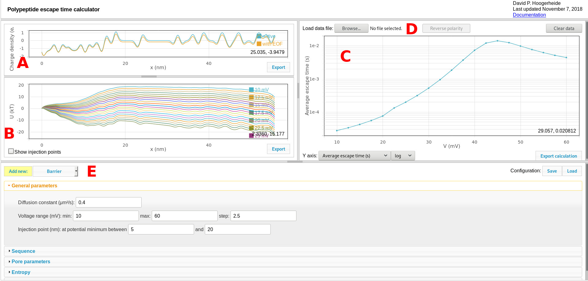
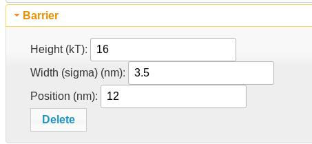

# Polypeptide diffusion calculator (ppdiffuse)
## Web-based calculator for voltage-driven transport of polypeptides through nanopores

## [Run calculator](./ppdiffuse.html)

### References
+ Hoogerheide et al., *Biophysical Journal* 2018. "Real-Time Nanopore-Based Recognition of Protein Translocation Success." [doi:10.1016/j.bpj.2017.12.019](https://doi.org/10.1016/j.bpj.2017.12.019)
+ Hoogerheide et al., *Nanoscale* 2017. "Mechanism of α-synuclein translocation through a VDAC nanopore revealed by energy landscape modeling of escape time distributions." [doi:10.1039/C6NR08145B](https://doi.org/10.1039/C6NR08145B)
+ Hoogerheide et al., *Phys. Rev. Lett.* 2013. "Escape of DNA from a Weakly Biased Thin Nanopore: Experimental Evidence for a Universal Diffusive Behavior." [doi:10.1103/PhysRevLett.111.248301](https://doi.org/10.1103/PhysRevLett.111.248301)
+ B. Lu et al., *Phys. Rev. E* 2012. "Effective driving force applied on DNA inside a solid-state nanopore." [doi:10.1103/PhysRevE.86.011921](https://doi.org/10.1103/PhysRevE.86.011921)
+ S. van Dorp et al., *Nature Physics* 2009. "Origin of the electrophoretic force on DNA in solid-state nanopores." [doi:10.1038/nphys1230](https://doi.org/10.1038/nphys1230)

### Introduction

Voltage-driven transport of charged polyelectrolytes through nanopores perforating thin membranes is of contemporary technical importance due to its role in next-generation DNA sequencing. The forces governing voltage-driven transport of homogeneously charged polyelectrolytes such as DNA are reasonably well understood, because a constant transmembrane potential acts unidirectionally on a polyelectrolyte captured in a nanopore. In most practical situations, the electrostatic forces overwhelm thermal fluctuations on the time scales governing whole-polymer movements, and the polymer translocates with essentially unity probability.

When a heterogeneous linear charge density is introduced, the situation becomes much more complex. Translocation across the membrane (as opposed to retraction to the side from which molecule was captured) is no longer assured. Diffusion plays a much larger role, particularly when the voltage-derived forces are balanced by others, such as membrane adhesion, electrokinetic flow, and entropic forces.

This calculator derives from the modeling work given in the references, in which a fairly straightforward theory of polypeptide diffusion is optimized to measurements of the voltage-dependent interaction of α-synuclein with the Voltage-Dependent Anion Channel (VDAC). The theory involves building up a quasi-potential from the various forces in play:

+ Transmembrane electric fields
+ Entropy of a polymer confined in a nanopore
+ Membrane binding
+ Hydrodynamic drag (when a salt gradient is present)

Other forces, such as localized barriers or binding potential wells, could also be present. The current calculator includes barriers (error functions), Gaussians, and constant forces, but can easily be extended to include any contribution to the diffusion potential.

The escape times and probabilities are calculated by applying the Smoluchowski equation to the diffusion potential, assuming a constant diffusion constant.

### Calculator interface

The default calculator view is shown here:

Components include:
#### A. Charge density graphic 
The charge density plot shows the linear charge density of the polyelectrolyte, which determines its interaction with the transmembrane potential. The two curves show the sequence-dependent charge density (determined by the [sequence](#sequence) controls) and the effective charge density (shown after modification with the pore characteristics, as set by the [pore parameters](#pore-parameters) controls). Use the "export" button to export these curves to a tab-separated text file.

#### B. Quasipotential graphic
The quasipotential plot shows the diffusion potential that serves as input to the Smoluchowski treatment for estimating first passage (escape) times. One curve is shown for each voltage calculated. Use the "export" button to export these curves to a tab-separated text file.

#### C. Results graphic

The results graphic shows the results of the Smoluchowski equation calculation. The controls on the bottom of the panel select the quantity to be plotted. The average escape time is what is typically measured in experiments. Using salt gradients (see [references](#References)), the conditional escape times for retraction and translocation events can also be determined (the "average retraction time" or "average translocation time"). The retraction and translocation probabilities can also be plotted.

#### D. Load data

The results graphic can allow direct comparison of experimental data (given in a three-column format: voltage, average time, and uncertainty in the average time) to the calculated values. Use the "reverse polarity" button to reverse the polarity of the voltage axis for the loaded data to allow direct comparison to the calculation, which has a fixed polarity (positive voltages are relative to the *trans* side of the membrane).

#### E. [Quasipotential and calculation controls](#Quasipotential-controls)

Contains all of the controls for the quasipotential and calculation. Use the "Save" configuration button to export the entire configuration in a JSON format (loaded data are not saved) that can be re-loaded using the "Load" button.

### Quasipotential controls

The calculation and quasipotential controls are divided into panels. The description of each follows.

#### General parameters

+ The diffusion constant is assumed independent of position and thus acts as a scaling factor on the time scale of the calculation. This value is appropriate only for the VDAC channel but is a good starting point for polypeptides in channels of a similar size.
+ The voltage range sets the transmembrane potentials at which the calculation should be performed.
+ The injection point is the position at which the polyelectrolyte is first detected. If there is one, the potential minimum should be chosen as the starting point. The potential minimum between the values given here is used as the injection point. If the values are set to be the same, that value is used as the injection point.

#### Sequence

+ The polypeptide sequence determines both the length of the diffusion region (0.4 nm per amino acid) and the charge density profile in the [charge density graphic](#a-charge-density-graphic). Spaces are ignored. Lysine (K), arginine (R), and histidine (H) residues are assigned +1 charges, while aspartic (D) and glutamic (E) acid residues are assigned -1. An Alexa 488 tag (X) is assigned a -2 charge.
+ The polypeptide always translocates from left to right, so the "direction" control sets the order of the amino acids.
+ The reverse button reverses the amino acid order.

#### Pore parameters

+ The pore length is implemented as the FWHM of a Gaussian filter used to smooth the charge density profile. This accounts for the fact that multiple residues will be in the pore simultaneously.
+ The electroosmotic slope and intercept parameters describe the modification of the charge density due to its disruption of the electroosmotic flow in the nanopore. The slope is essentially the fraction of the charge density that is not counteracted by the electrokinetic flow; the intercept is proportional to the effective charge density of the empty pore. For VDAC, which has a positively charged pore lumen, this value is negative, and indicates that a charge density of -0.18 e/nm is required to electrostatically cancel the pore lumen charges. The slope of 0.908 indicates that the effective charge density acted on by the electric field is approximately 90%. For DNA in solid-state nanopores, where hydrodynamic flow plays a larger role than in the more confined biological nanopores, this value can be [as low as 0.1](https://doi.org/10.1103/PhysRevE.86.011921).

#### Entropy

The entropy controls extend the calculator to treat tethered polyelectrolytes (*i.e.* when translocation is known to be impossible).
+ The entropy function is rather different in the tethered case, and turning on the tethering option applies the appropriate entropy function.
+ The tether length is a sensitive parameter that sets the maximum extension of the tethered polyelectrolyte.

#### Custom quasipotential elements

The "Add new: " button allows custom elements to be added to the quasipotential. These include barrier (error function), gaussian, and constant force elements. The fields are self-explanatory, so only "barrier" is shown here. 

Each custom element can be removed from the calculation using the "delete" button.

##### Barrier element

A barrier element adds an error function of the given height (negative reduces the direction of the barrier), width (sigma), and position along the polypeptide. This is useful for membrane tethering. Two of them with equal and opposite heights can be combined to create a potential plateau.

##### Gaussian element

A gaussian element adds a gaussian function of the specified height and width (sigma) at the specified position. Note that this is an *unnormalized* Gaussian; the height of the Gaussian will be equal to the height of the barrier at its maximum point.

##### Constant force element

A constant force element adds a constant slope to the quasipotential. The beginning and ending positions of the slope are specified by the controls, as is the magnitude of the force in pN. The converstion is 4.11 pN = 1  kT/nm at room temperature.